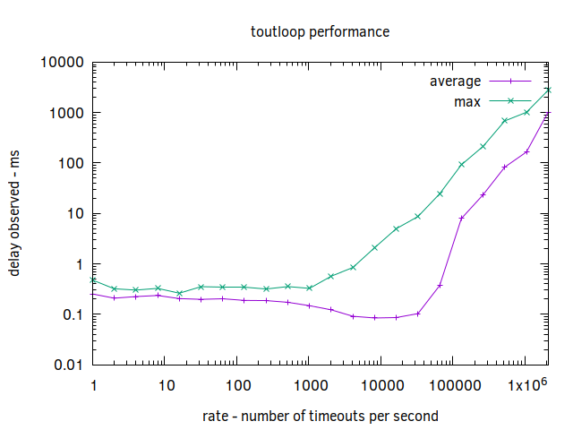

A tight running loop that tracks timeouts at scale.

[](https://circleci.com/gh/anekkanti/toutloop)
[](https://godoc.org/github.com/anekkanti/toutloop)
[](https://goreportcard.com/report/github.com/anekkanti/toutloop)
[](https://codecov.io/gh/anekkanti/toutloop)


The loop uses the [`container/heap`](https://golang.org/pkg/container/heap/) package to track timeouts and deliver them as they expire. User can add, reschedule or remove timeouts. The expired timeouts can be received on the `ToutLoop.C` channel.

## Usage
Import the package using: 

```go
import "github.com/anekkanti/toutloop"
```

Here an example that creates a timeout and receives it.
```go

type tjob struct {
	name string
}

func main() {
	tloop := New(0 /*recieveChanBufferSize*/ )
	tloop.Run()

	j1 := &tjob{name: "j1"}
	err := tloop.Add(j1.name, j1, time.Millisecond*300)
	if err != nil {
		panic(err)
	}

	err = tloop.Reschedule(j1.name, time.Millisecond*400)
	if err != nil {
		panic(err)
	}

	for j := range tloop.C {
		if j.(*tjob) == j1 {
			break
		}
	}
	tloop.Stop()
}
```

## Performance 



As observed in the chart, the loop performs with lower then millisecond delay for events when its scheduling upto 10K events per second. After which the performance degrades and the toutloop can't seem to keep up with expiring timeouts. 
